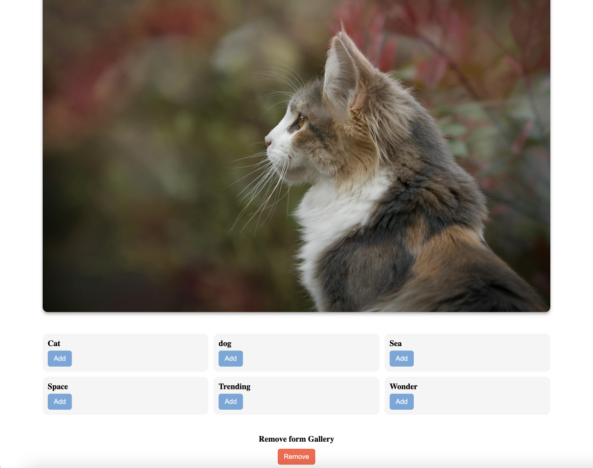

## Gallery/Photo App

## Project Description

This project is a learning exercise that utilizes the Pexels API for fetching images and integrates it with a Node.js, Express, MongoDB, and Mongoose backend. The goal is to create a simple application that allows users to explore and manage collections of images sourced from Pexels.

## ERD

## Screenshots

screenshots app
Home page:

Search page:

## Technologies Used

List of technologies used in Project.

-   [Pexels API](https://www.pexels.com/api/documentation/)
-   Node.js
-   Express.js
-   MongoDB and Mongoose
-   EJS
-   HTML/CSS
-   Javascript
-   OAuth
-   Passport

### Getting Started

https://project02.onrender.com

### 🚀 Next Steps

Features that can be added in future:

-   Pexels Video API Search function
-   Add admin User
